# multiagent-template — Multi-Agent AI Orchestration for Autonomous Code Generation

**Autonomous multi-agent code generation and PR automation for 12 AI coding assistants.** Scaffold a structured workspace where specialized agents (orchestrator, architect, developer, reviewer, DevOps, designer) operate in a gated pipeline (PLAN → BUILD → TEST → VERIFY → SHIP) to drive software from backlog to merged PR autonomously — without context collapse, without code review bottlenecks, without hand-holding. You set direction; the agents handle execution.

[](https://www.nuget.org/packages/multiagent-setup)
[](https://github.com/Neftedollar/multiagent-template/actions/workflows/build.yml)
[](https://github.com/Neftedollar/multiagent-template/stargazers)
[](LICENSE)
[](https://github.com/Neftedollar/multiagent-template/discussions)

**Tags:** AI agent orchestration · multi-agent AI · autonomous code generation · Claude Code · AI workflow automation · code review pipeline · agent routing · multi-LLM support · Claude Sonnet · OpenAI Codex · Gemini CLI

<p align="center">
  
</p>

---

## Quick Start

**Which command do I need?**

| Situation | Command |
|-----------|---------|
| Starting a new project | `multiagent-setup new <name>` |
| Adding to an existing git repo | `multiagent-setup init .` |

**macOS — Homebrew (no .NET required):**

```bash
brew install Neftedollar/multiagent-template/multiagent-setup
multiagent-setup new MyProject          # new workspace
multiagent-setup init .                 # add to existing repo
```

**One-liner bootstrap** (installs all deps including Homebrew/winget, agent CLI, and creates the workspace):

```bash
# macOS / Linux
curl -fsSL https://raw.githubusercontent.com/Neftedollar/multiagent-template/main/bootstrap.sh | bash -s -- MyProject
curl -fsSL https://raw.githubusercontent.com/Neftedollar/multiagent-template/main/bootstrap.sh | bash -s -- MyProject --provider gemini

# Windows (PowerShell)
irm https://raw.githubusercontent.com/Neftedollar/multiagent-template/main/bootstrap.ps1 -OutFile bootstrap.ps1
.\bootstrap.ps1 MyProject
.\bootstrap.ps1 MyProject --provider codex
```

**NuGet** (.NET 10+ required):

```bash
dotnet tool install -g multiagent-setup
multiagent-setup new MyProject                       # Claude (default)
multiagent-setup new MyProject --provider nessy      # Nessy CLI (Claude alias)
multiagent-setup new MyProject --provider codex      # OpenAI Codex
multiagent-setup new MyProject --provider qwen       # Qwen Code
multiagent-setup new MyProject --provider cursor     # Cursor IDE
multiagent-setup new MyProject --provider windsurf   # Windsurf IDE
multiagent-setup new MyProject --provider copilot    # GitHub Copilot
multiagent-setup new MyProject --provider gemini     # Google Gemini CLI
multiagent-setup new MyProject --provider cline      # Cline (VS Code)
multiagent-setup new MyProject --provider aider      # Aider AI pair programmer
multiagent-setup new MyProject --provider continue   # Continue.dev (VS Code / JetBrains)
multiagent-setup new MyProject --provider roo        # Roo Code (VS Code)
multiagent-setup new MyProject --provider all        # all providers at once

# Choose a workspace template (saas, oss, internal, or default)
multiagent-setup new MyProject --template saas       # SaaS product (user-impact gates, feature flags, SLO review)
multiagent-setup new MyProject --template oss        # Open source (CHANGELOG, semver, backward-compat gates)
multiagent-setup new MyProject --template internal   # Internal tools (lighter pipeline, no external gates)

# Add workspace files to an existing git repo (does not touch your code)
multiagent-setup init .                              # current directory
multiagent-setup init ./my-repo                      # specific directory
multiagent-setup init . --template saas              # with template

# Add a provider to an existing workspace (no need to recreate)
multiagent-setup add-provider cursor
multiagent-setup add-provider gemini --force   # overwrite existing files
multiagent-setup add-provider all              # add all providers at once

# Manage providers
multiagent-setup list-providers               # show installed vs. available providers
multiagent-setup remove-provider cursor       # cleanly remove a provider and its files

# Update an existing workspace to the latest templates
multiagent-setup update          # skip already-customised files
multiagent-setup update --force  # overwrite everything (CLAUDE.md preserved)
```

Then start working:

```bash
cd MyProject
claude          # or: nessy / codex / qwen-code / gemini (terminal agents)
                # or open in Cursor / Windsurf / VS Code (IDE agents)
/orchestrator Implement user authentication with JWT
```

**What happens next:**
1. Orchestrator reads `docs/process.md` and selects roles dynamically
2. Creates a plan and asks: `APPROVED / NEEDS WORK?`
3. Proceeds through **PLAN → BUILD → TEST → VERIFY → SHIP**
4. Opens a PR on GitHub when done — no manual intervention needed

> Interactive mode: Claude asks for gate approval at each step.  
> Autonomous mode (`claude -p`): runs fully headless, escalates blockers to GitHub Issues.

**What you get in 5 minutes:**
- A workspace where agents run `PLAN → BUILD → TEST → VERIFY → SHIP` autonomously
- 20+ specialist roles installed in `~/.claude/commands/` — orchestrator, architect, developer, reviewer, DevOps, designer, and more
- Safety hooks active: dangerous commands blocked, commits enforced as conventional, files auto-linted on save
- One human touchpoint: review and merge the PR when the pipeline finishes

---

## Why multiagent-template?

**The problem**: Asking a single AI agent to be architect, developer, reviewer, and DevOps all at once leads to context collapse, no accountability, and inconsistent quality.

**The solution**: A structured workspace where each agent plays a defined role in a gated pipeline:

```
PLAN → BUILD → TEST → VERIFY → SHIP
```

- **Orchestrator** coordinates — never writes code itself
- **Architects** design before developers build
- **Reviewers** validate independently after each step
- **Safety hooks** prevent dangerous commands, enforce commit conventions, auto-lint

Each step has an approval gate. Failures retry (3×) → helper role (2×) → human escalation. The human only sees escalations, not every step.

### When to choose multiagent-template

| Scenario | multiagent-template | Single Claude Code | Standalone Aider |
|----------|--------------------|--------------------|-----------------|
| Pair-programming a single file | — | ✅ | ✅ |
| Full feature from spec to merged PR | ✅ | Struggles | Struggles |
| Team of specialized roles | ✅ | ❌ | ❌ |
| Autonomous overnight backlog drain | ✅ | Limited | ❌ |
| Works inside your existing IDE | ✅ (via provider flags) | ✅ | ✅ |
| Any AI provider (Claude, Gemini, Codex…) | ✅ 12 providers | Claude only | Any, but no pipeline |

---

## Supported Providers

| Provider | Binary / Tool | Best for | Notes |
|----------|---------------|----------|-------|
| **claude** | `claude` | Terminal-first, most capable | [Claude Code](https://docs.anthropic.com/en/docs/claude-code) by Anthropic — default |
| **nessy** | `nessy` | Claude users with a different alias | [Nessy CLI](https://nessy.ai) — Claude-compatible |
| **codex** | `codex` | OpenAI API key holders | [OpenAI Codex CLI](https://github.com/openai/codex) — creates `AGENTS.md` |
| **qwen** | `qwen-code` | Open-source model users | [Qwen Code](https://github.com/QwenLM/qwen-code) — creates `QWEN.md` |
| **gemini** | `gemini` | Google API key holders | [Gemini CLI](https://github.com/google-gemini/gemini-cli) — creates `GEMINI.md` |
| **cursor** | [Cursor](https://cursor.com) IDE | IDE-first workflows | Rules in `.cursor/rules/` (MDC format) |
| **windsurf** | [Windsurf](https://windsurf.com) IDE | IDE-first + Codeium users | Rules in `.windsurf/rules/` (Wave 8+) |
| **copilot** | GitHub Copilot | VS Code + GitHub users | Reads `.github/copilot-instructions.md` |
| **cline** | [Cline](https://github.com/cline/cline) | VS Code extension users | Creates `.clinerules` in project root |
| **aider** | [Aider](https://aider.chat) | Terminal pair programming | Creates `.aider.conf.yml` — auto-reads CLAUDE.md |
| **continue** | [Continue.dev](https://continue.dev) | VS Code + JetBrains users | `.continue/config.yaml` with `/orchestrator` slash command |
| **roo** | [Roo Code](https://github.com/RooVetGit/Roo-Code) | VS Code extension users | Rules in `.roo/rules/` — auto-loaded per project |

Use `--provider all` to scaffold all providers (claude + nessy + codex + qwen + cursor + windsurf + copilot + gemini + cline + aider + continue + roo).

---

## How It Works

One human (CEO) gives tasks. The **Orchestrator** agent breaks them into steps, picks the right specialist role, runs the pipeline, and delivers a PR. Human escalation is required only for: public content, breaking API changes, infra decisions with cost impact, or 5+ consecutive failures.

### Pipeline types

| Type | Steps | When |
|------|-------|------|
| `feature` | PLAN → BUILD → TEST → VERIFY → SHIP | New functionality |
| `bugfix` | BUILD → TEST → VERIFY → SHIP | Skip planning |
| `infra` | PLAN → BUILD → VERIFY → SHIP | No test step |
| `content` | PLAN → BUILD → VERIFY(CEO) | Docs / marketing |
| `spike` | PLAN | Research only |

### Modes

| Mode | How to trigger | Description |
|------|----------------|-------------|
| **CEO Mode** | `/orchestrator <task>` | Human gives task, orchestrator executes |
| **Single Expert** | `/<role> <question>` | Direct expert call, no pipeline |
| **Autonomous** | `claude -p "/orchestrator ..."` | Orchestrator self-selects tasks from backlog |

---

## Workspace Structure

```
MyProject/
├── CLAUDE.md                <- workspace context (read by AI on every session)
├── code/                    <- product repo (git-ignored)
├── docs/
│   ├── process.md           <- operational manual (pipeline source of truth)
│   ├── role-capabilities.md <- role index for dynamic orchestrator routing
│   └── workflows/           <- pipeline specs (WORKFLOW-*.md)
├── .claude/
│   ├── commands/            <- slash-command roles (synced from agency-agents)
│   ├── hooks/lint.json      <- auto-lint formatter config
│   ├── mcp.json             <- MCP server config
│   └── settings.json        <- hook configuration
├── .github/
│   └── workflows/
│       └── orchestrator.yml <- run orchestrator in CI (claude/nessy providers)
├── .codex/                  <- Codex config (--provider codex)
│   └── skills/              <- orchestrator skill pre-loaded
└── tools/
    ├── completions.zsh      <- zsh completions
    └── completions.ps1      <- PowerShell completions
```

### Two CLAUDE.md files

The workspace uses two separate instruction files:

| File | Purpose |
|------|---------|
| `CLAUDE.md` (workspace root) | **How Claude operates** — pipeline, roles, process, team structure |
| `code/<project>/CLAUDE.md` | **What Claude builds** — architecture, patterns, build commands, test setup |

When you clone your code repo into `code/<project>/`, create a `CLAUDE.md` there describing the codebase (or copy your existing one). Claude Code automatically reads both files.

**Bringing in an existing codebase:**

```bash
multiagent-setup new MyProject
cd MyProject
git clone https://github.com/my-org/my-repo code/MyProject
# Edit CLAUDE.md to describe the project → done
```

---

## Hook System

All hooks are compiled into the `multiagent-setup` binary — no shell scripts, no platform quirks.

| Hook | Trigger | Action |
|------|---------|--------|
| `block-dangerous` | PreToolUse (Bash) | Blocks `rm -rf /`, `push --force main`, `DROP TABLE`, etc. |
| `enforce-commit-msg` | PreToolUse (Bash) | Enforces conventional commits (`feat:`, `fix:`, etc.) |
| `auto-lint` | PostToolUse (Edit/Write) | Runs formatter on changed file (prettier, ruff, gofmt, rustfmt…) |
| `log-agent` | PreToolUse (Agent) | Logs sub-agent launches to `.claude/agent-log.jsonl` |
| `stop-guard` | Stop | Reminds to run tests and update knowledge graph |
| `research-reminder` | PostToolUse (WebSearch) | Reminds to persist research in O'Brien memory |

---

## Agent Roles

> **Built on [agency-agents](https://github.com/msitarzewski/agency-agents)** — a community-maintained library of specialist Claude Code slash commands. `multiagent-setup sync-roles` clones and installs the full set at workspace creation. Go star that repo too — it's what makes the roles work.

20+ specialist roles installed automatically:

| Layer | Roles |
|-------|-------|
| Strategy | `/product-manager`, `/product-trend-researcher` |
| Management | `/orchestrator`, `/testing-reality-checker`, `/specialized-workflow-architect` |
| Engineering | `/engineering-software-architect`, `/engineering-backend-architect`, `/engineering-frontend-developer`, `/engineering-code-reviewer`, `/engineering-devops-automator`, `/engineering-security-engineer` |
| AI / ML | `/engineering-ai-engineer` |
| Design | `/design-ux-researcher`, `/design-ui-designer` |
| GTM | `/specialized-developer-advocate`, `/engineering-technical-writer`, `/marketing-content-creator` |

The orchestrator routes dynamically via `docs/role-capabilities.md` — no hardcoded assignments. If no role fits, it creates an ad-hoc role on the fly.

---

## Infrastructure (Optional)

### AGE Graph
Graph knowledge base on PostgreSQL + [Apache AGE](https://age.apache.org/), connected via [age-mcp](https://github.com/Neftedollar/age-mcp). Stores modules, pipelines, role bindings, security findings, code insights. Grows with every task.

### O'Brien
Semantic memory on pgvector — cross-session context, task locking, crash recovery.

```bash
multiagent-setup install-mcps             # interactive Docker setup
multiagent-setup install-mcps --manual    # enter connection strings manually
```

---

## Examples

See [`examples/`](examples/) for concrete workflows:
- [SaaS Starter](examples/saas-starter.md) — foundation, auth, billing, autonomous sessions
- [Open Source Maintainer](examples/open-source-maintainer.md) — bug triage, PR reviews, releases

---

## CLI Reference

```bash
multiagent-setup new <project> [org] [--provider claude|nessy|codex|qwen|cursor|windsurf|copilot|gemini|cline|aider|continue|roo|all] [--template default|saas|oss|internal]
multiagent-setup init [dir] [--provider <name>] [--template <name>] [--force]   # add workspace to existing repo
multiagent-setup add-provider <provider> [--force]            # add provider to existing workspace
multiagent-setup remove-provider <provider> [--force]         # remove a provider and its files
multiagent-setup list-providers                               # list installed and available providers
multiagent-setup update [--force]                             # update workspace templates to latest version
multiagent-setup sync-roles [--clone|--pull] [--global] [--agency-dir <path>]
multiagent-setup install-mcps [--docker|--manual] [--age-conn <str>] [--obrien-conn <str>] [--target <dir>]
multiagent-setup hook <name>
multiagent-setup doctor [--for sync-roles|init|update]       # check workspace or run pre-flight check
multiagent-setup -v | --version
```

---

## Requirements

| Tool | macOS/Linux | Windows |
|------|-------------|---------|
| [.NET SDK](https://dotnet.microsoft.com/download) 10+ | `brew install dotnet` | `winget install Microsoft.DotNet.SDK.10` |
| [GitHub CLI](https://cli.github.com/) | `brew install gh` | `winget install GitHub.cli` |
| git, jq | brew / apt | `winget install Git.Git jqlang.jq` |
| Agent CLI | see provider table above | same |
| Docker | optional, for AGE/O'Brien | `winget install Docker.DockerDesktop` |

`bootstrap.sh` / `bootstrap.ps1` install everything automatically on a clean machine.

---

## Contributing

Templates live in [`tools/setup-cli/Templates/`](tools/setup-cli/Templates/). Each provider gets its own directory under `providers/`. See [CONTRIBUTING.md](CONTRIBUTING.md) for setup instructions and how to add a new provider.

Questions and ideas → [Discussions](https://github.com/Neftedollar/multiagent-template/discussions).

If this saves you time, a ⭐ star helps others find it.

---

## FAQ

**Does this work with projects that already have code?**  
Yes — two options: (1) run `multiagent-setup init .` inside your existing repo to add workspace files directly, or (2) run `multiagent-setup new MyProject` to create a separate workspace, then clone your repo into `code/MyProject/`.

**How do I use multiple providers?**  
Run `multiagent-setup new MyProject --provider all` to scaffold all providers at once. To add a provider to an existing workspace: `multiagent-setup add-provider gemini`.

**What does the orchestrator do when I'm not watching?**  
In CEO Mode it waits for your next task. In Autonomous mode (`claude -p`), it picks tasks from the GitHub Project backlog and escalates only for defined edge cases.

**Can I add custom roles?**  
Yes. Create a `.md` file in `.claude/commands/` with a `name:` frontmatter field. The orchestrator uses it automatically, and can also create ad-hoc roles on the fly.

**Do I need Docker / AGE graph / O'Brien?**  
No. The MCPs are entirely optional. The workspace and pipeline work without them. `install-mcps` is a separate optional step for teams that want persistent memory across sessions.

**A safety hook is blocking a command I need.**  
Claude Code will prompt you to approve or deny the hook's decision. Click "Allow" to override for that command. You can also edit `.claude/settings.json` to adjust which hooks are active.

**How do I update an existing workspace to the latest templates?**  
Run `multiagent-setup update` from inside your workspace. Your customised context files (`CLAUDE.md`, `GEMINI.md`, etc.) are preserved. Add `--force` to overwrite everything.

**Where can I see what agents were spawned in a session?**  
The `log-agent` hook writes to `.claude/agent-log.jsonl` — one JSON line per agent launch with timestamp, type, model, and prompt preview.

**Is this production-ready?**  
Yes. The tool has a stable API (breaking changes only in major version bumps). It's used for autonomous overnight runs and SaaS development sessions. The `doctor` command checks your workspace for common config issues.

**Can the orchestrator run in CI without a local machine?**  
Yes. A GitHub Actions workflow (`orchestrator.yml`) is scaffolded for claude/nessy workspaces. It triggers on issue labels and runs the orchestrator headlessly via `claude -p`. See [examples/](examples/) for autonomous session patterns.

**Does the pipeline need internet access?**  
Only for git push/PR creation steps and any web research the agent does. All local code analysis, formatting, and linting runs offline.

---

[Русская версия](README_RU.md) | [Landing page](https://neftedollar.com/multiagent-template/)
